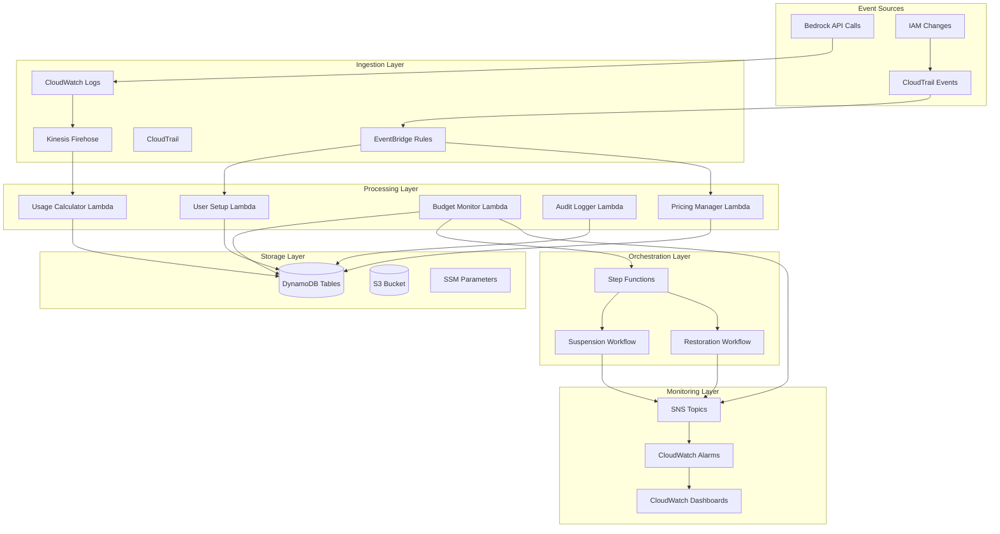
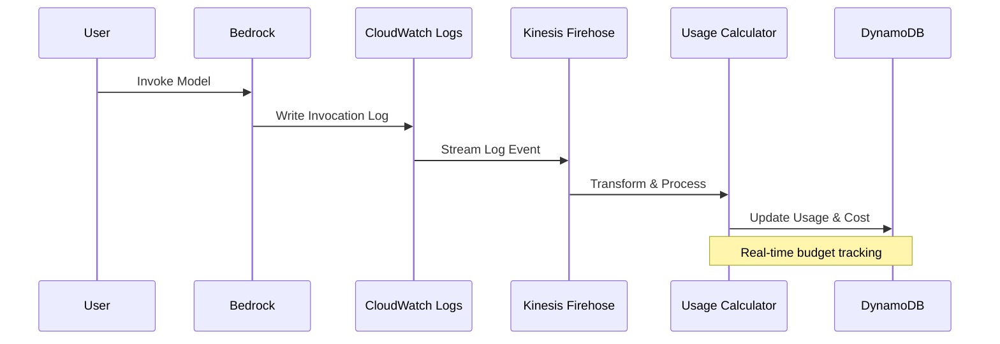
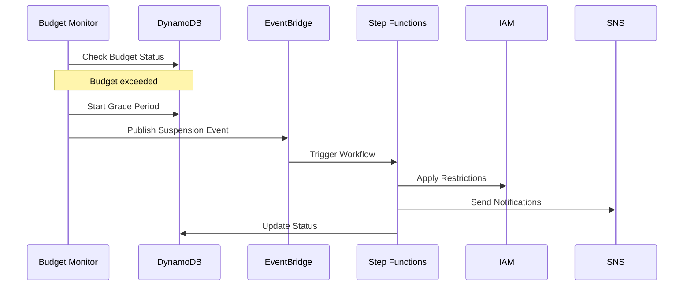
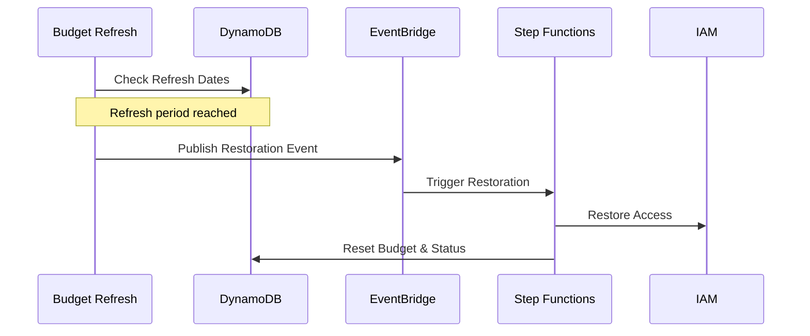

# Bedrock Budgeteer System Architecture

## Overview

Bedrock Budgeteer is a comprehensive serverless budget monitoring and control system for AWS Bedrock API usage. It provides real-time cost tracking, automated threshold monitoring, and progressive access control to prevent budget overruns.

## System Goals

- **Real-time cost visibility**: Compute token-based costs using the AWS Pricing API
- **Proactive controls**: Multi-level thresholds with alerts and graduated suspension system
- **Operational safety**: Circuit breaker, DLQs, audit trails, and idempotent workflows
- **Separation of concerns**: Clear boundaries across ingestion, evaluation, enforcement, and audit

## High-Level Architecture

The system follows an event-driven serverless architecture with clear separation between data ingestion, processing, orchestration, and monitoring layers.



## Core Components

### 1. Data Storage Layer

**DynamoDB Tables:**
- `UserBudgets` - Principal budget tracking and status
- `UsageTracking` - Historical usage and cost data
- `AuditLogs` - System audit trail
- `Pricing` - Cached Bedrock model pricing data

**Key Attributes:**
```json
// UserBudgets table
{
  "principal_id": "string",
  "budget_limit_usd": "number",
  "spent_usd": "number", 
  "status": "active|suspended|grace_period",
  "account_type": "bedrock_api_key|user|service",
  "budget_refresh_date": "ISO8601",
  "grace_deadline_epoch": "number"
}

// Pricing table
{
  "model_id": "string",
  "region": "string",
  "input_tokens_per_1000": "decimal",
  "output_tokens_per_1000": "decimal",
  "ttl": "number"
}
```

### 2. Event Ingestion Layer

**CloudTrail Configuration:**
- Captures all Bedrock API calls (`InvokeModel`, `InvokeModelWithResponseStream`)
- Monitors IAM changes affecting Bedrock access
- Integrates with EventBridge for real-time processing

**EventBridge Rules:**
- `bedrock-usage`: Routes Bedrock API events to processing
- `iam-key-creation`: Captures new API key creation for user setup
- `iam-bedrock-permissions`: Tracks permission changes

**Kinesis Data Firehose:**
- Streams Bedrock invocation logs to S3
- Invokes Usage Calculator Lambda for real-time processing
- Provides data transformation and enrichment

### 3. Core Processing Layer

**Lambda Functions:**

1. **User Setup Lambda**
   - Triggered by IAM API key creation events
   - Initializes budget entries for new users
   - Sets default budget limits and configuration

2. **Usage Calculator Lambda**
   - Processes Bedrock invocation logs from Firehose
   - Calculates token costs using AWS Pricing API
   - Updates budget consumption in real-time

3. **Budget Monitor Lambda**
   - Runs every 5 minutes via EventBridge schedule
   - Evaluates budget thresholds (70% warning, 90% critical, 100% exceeded)
   - Initiates grace period for budget violations
   - Triggers suspension workflows for grace period expiry

4. **Pricing Manager Lambda**
   - Maintains current Bedrock model pricing data
   - Refreshes pricing cache daily
   - Handles fallback pricing when API unavailable

5. **Budget Refresh Lambda**
   - Daily schedule to reset expired budgets
   - Triggers automatic restoration for suspended users
   - Manages budget refresh cycles

6. **Audit Logger Lambda**
   - Processes all system events for audit trail
   - Ensures compliance and traceability

### 4. Workflow Orchestration Layer

**Step Functions State Machines:**

1. **Suspension Workflow**
   ```mermaid
   graph TD
       A[Start] --> B[Send Grace Notification]
       B --> C[Grace Period Wait]
       C --> D[Send Final Warning]
       D --> E[Apply Full Suspension]
       E --> F[Update User Status]
       F --> G[Send Audit Event]
       G --> H[Success]
   ```

2. **Restoration Workflow**
   ```mermaid
   graph TD
       A[Start] --> B[Validate Restoration Request]
       B --> C{Validation Passed?}
       C -->|Yes| D[Restore Access]
       C -->|No| E[Skip Restoration]
       D --> F[Validate Access Restoration]
       F --> G[Reset Budget Status]
       G --> H[Send Audit Event]
       H --> I[Success]
       E --> J[End]
   ```

**Workflow Lambda Functions:**
- `IAM Utilities`: Manages IAM policy operations
- `Grace Period Notifications`: Handles user notifications
- `Policy Backup`: Backs up original policies before suspension
- `Restoration Validation`: Validates restoration eligibility

### 5. Monitoring and Alerting Layer

**SNS Topics:**
- `operational-alerts`: System operational issues
- `budget-alerts`: Budget threshold violations
- `high-severity`: Critical system alerts

**CloudWatch Dashboards:**
- System Overview: Lambda metrics, DynamoDB performance
- Ingestion Pipeline: CloudTrail, EventBridge, Firehose metrics
- Workflow Orchestration: Step Functions execution metrics
- Business Metrics: Budget violations, user activity, costs

**Multi-Channel Notifications:**
- Email subscriptions
- Slack webhook integration
- SMS for high-severity alerts
- Generic webhook for external integrations

## Data Flow Patterns

### 1. Real-time Usage Processing



### 2. Budget Violation Response



### 3. Automatic Restoration



## Security Architecture

### IAM Roles and Permissions

**Lambda Execution Role:**
- DynamoDB: Full access to application tables
- S3: Read access to logs bucket
- SSM: Read access to configuration parameters
- Bedrock: API access for model information
- Pricing: API access for cost calculation
- CloudWatch: Custom metrics publishing

**Step Functions Role:**
- Lambda: Invoke workflow functions
- DynamoDB: Read/write access to tables
- EventBridge: Publish audit events
- SQS: Send messages to DLQ

**Firehose Delivery Role:**
- S3: Write access to logs bucket
- KMS: Encrypt/decrypt with customer keys
- Lambda: Invoke usage calculator

### Encryption Strategy

**At Rest:**
- DynamoDB tables encrypted with customer-managed KMS key (optional)
- S3 buckets encrypted with KMS
- CloudWatch logs encrypted with KMS (optional)

**In Transit:**
- All API calls use HTTPS/TLS
- Inter-service communication encrypted by default

## Configuration Management

### SSM Parameter Hierarchy

```
/bedrock-budgeteer/
├── global/
│   ├── thresholds_percent_warn (70)
│   ├── thresholds_percent_critical (90)
│   ├── default_user_budget_usd (1)
│   └── grace_period_seconds (300)
└── production/
    └── cost/
        └── budget_refresh_period_days (30)
```

### Environment-Specific Configuration

- **Production**: Strict thresholds, longer grace periods, comprehensive monitoring
- **Development**: Relaxed thresholds, shorter grace periods, basic monitoring

## Operational Considerations

### Fault Tolerance

**Dead Letter Queues (DLQ):**
- All Lambda functions have DLQ configured
- Failed executions captured for manual retry
- 14-day retention for investigation

**Idempotent Operations:**
- All workflows support safe retry
- State reconciliation prevents drift
- Unique event IDs prevent duplicate processing

**Circuit Breaker:**
- Global emergency stop via SSM parameter
- Disables automated suspension while maintaining alerts
- Manual override for critical situations

### Scalability

**Auto-scaling Configuration:**
- DynamoDB tables with read/write auto-scaling
- Lambda concurrency managed automatically
- Firehose buffering for batch processing

**Cost Optimization:**
- S3 lifecycle policies for log retention
- CloudWatch log retention policies
- DynamoDB on-demand billing for variable workloads

### Monitoring and Observability

**Metrics:**
- System operational metrics
- Business KPI metrics
- Error rates and latencies
- Cost tracking metrics

**Alerting:**
- Threshold-based alarms
- Anomaly detection
- Multi-channel notifications
- Escalation procedures

**Dashboards:**
- Real-time system health
- Business metrics overview
- Operational troubleshooting views
- Cost analysis dashboards

## Compliance and Auditing

### Audit Trail

**Comprehensive Logging:**
- All budget changes logged
- IAM policy modifications tracked
- User suspension/restoration events
- System configuration changes

**Retention Policy:**
- Audit logs retained for compliance requirements
- S3 lifecycle policies for long-term storage
- DynamoDB TTL for automated cleanup

### Data Privacy

**Minimal Data Collection:**
- Only necessary user identifiers stored
- No sensitive business data captured
- Encryption for data at rest and in transit

## Disaster Recovery

### Backup Strategy

**DynamoDB:**
- Point-in-time recovery disabled for cost optimization
- Automated backups via DynamoDB native features
- Cross-region replication not implemented (single-region design)

**Configuration:**
- SSM parameters backed up via infrastructure as code
- CDK deployment enables environment recreation

### Recovery Procedures

**Service Restoration:**
1. Redeploy CDK stack in target region
2. Restore DynamoDB tables from backup
3. Update SSM parameters as needed
4. Validate service functionality

**Data Recovery:**
- DynamoDB table restoration from backup
- S3 data available across availability zones
- CloudWatch logs retention for investigation

