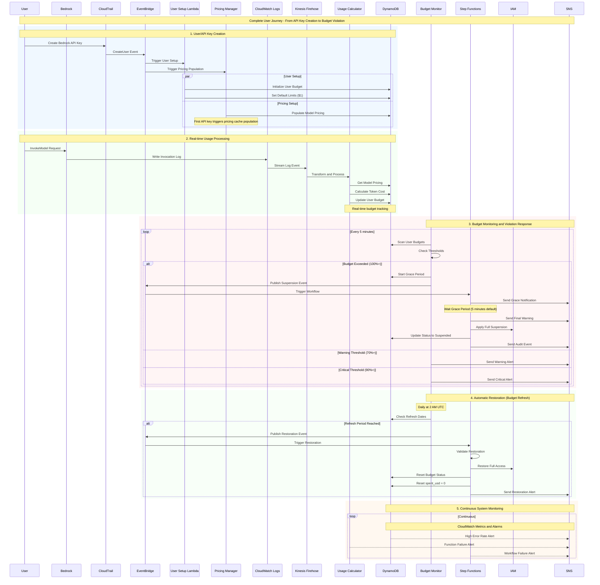
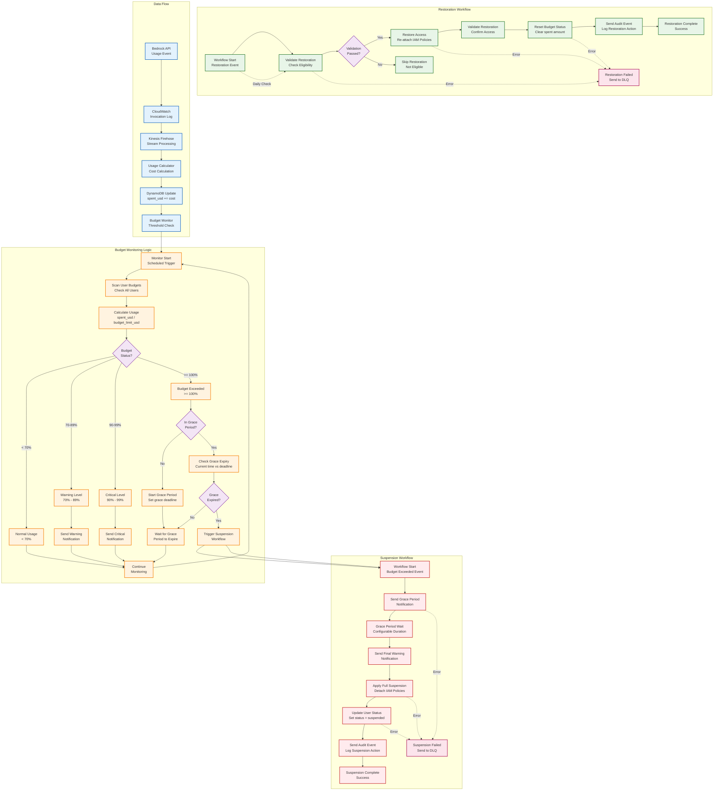
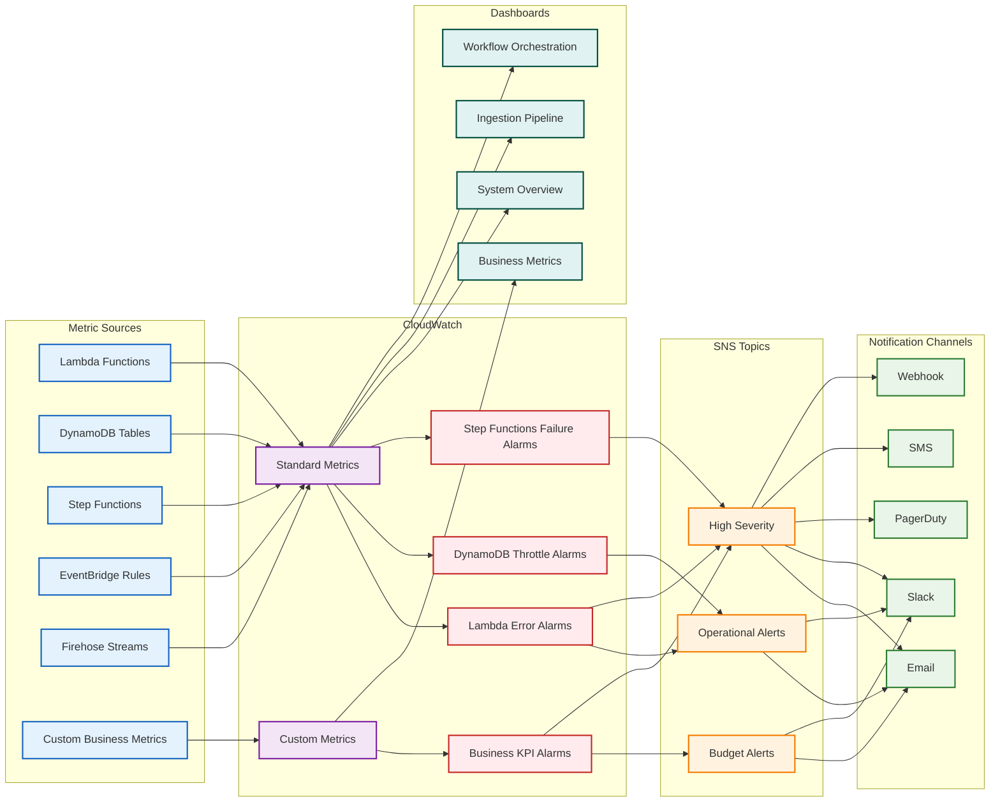

# System Diagrams - Bedrock Budgeteer

## Overview

This document contains visual representations of the Bedrock Budgeteer system architecture, data flows, and operational workflows. These diagrams provide a comprehensive view of how components interact and data flows through the system.

## System Architecture Diagram

The following diagram shows the complete system architecture with all major components and their relationships:

```mermaid
graph TB
    subgraph "User Interaction"
        U[User/API Key]
        BR[Bedrock API Calls]
    end
    
    subgraph "Event Ingestion Layer"
        CT[CloudTrail<br/>Multi-Region Trail]
        EB[EventBridge Rules<br/>bedrock-usage<br/>iam-key-creation<br/>iam-permissions]
        CWL[CloudWatch Logs<br/>Bedrock Invocation Logs]
        KF[Kinesis Firehose<br/>bedrock-usage-logs]
        S3B[S3 Bucket<br/>Log Storage]
    end
    
    subgraph "Core Processing Layer"
        US[User Setup Lambda<br/>Initialize Budgets]
        UC[Usage Calculator Lambda<br/>Real-time Cost Calculation]
        BM[Budget Monitor Lambda<br/>Threshold Evaluation]
        BR[Budget Refresh Lambda<br/>Periodic Reset]
        AL[Audit Logger Lambda<br/>Compliance Tracking]
        PM[Pricing Manager Lambda<br/>Price Cache Management]
    end
    
    subgraph "Data Storage Layer"
        UB[(UserBudgets Table<br/>Principal Budget Tracking)]
        UT[(UsageTracking Table<br/>Historical Usage Data)]
        AD[(AuditLogs Table<br/>System Audit Trail)]
        PR[(Pricing Table<br/>Model Price Cache)]
        SSM[SSM Parameters<br/>Configuration Store]
    end
    
    subgraph "Workflow Orchestration Layer"
        SF1[Suspension Workflow<br/>Step Functions]
        SF2[Restoration Workflow<br/>Step Functions]
        
        subgraph "Workflow Functions"
            IU[IAM Utilities<br/>Policy Management]
            GP[Grace Period<br/>Notifications]
            PB[Policy Backup<br/>Restore Point]
            RV[Restoration Validation<br/>Eligibility Check]
        end
    end
    
    subgraph "Monitoring &amp; Alerting Layer"
        SNS1[Operational Alerts<br/>SNS Topic]
        SNS2[Budget Alerts<br/>SNS Topic]
        SNS3[High Severity<br/>SNS Topic]
        
        subgraph "Notification Channels"
            EMAIL[Email<br/>Subscriptions]
            SLACK[Slack<br/>Webhook Integration]
            PD[PagerDuty<br/>Critical Alerts]
            SMS[SMS<br/>High Priority]
        end
        
        subgraph "Observability"
            CWD[CloudWatch<br/>Dashboards]
            CWA[CloudWatch<br/>Alarms]
            CWM[Custom<br/>Metrics]
        end
    end
    
    subgraph "External Services"
        PRICING[AWS Pricing API<br/>Real-time Model Costs]
        IAM[AWS IAM<br/>Access Control]
        BEDROCK[AWS Bedrock<br/>Foundation Models]
    end
    
    %% User flow
    U --> BR
    BR --> BEDROCK
    
    %% Ingestion flow
    BEDROCK --> CWL
    BEDROCK --> CT
    CT --> EB
    CWL --> KF
    KF --> S3B
    KF --> UC
    
    %% Event routing
    EB --> US
    EB --> PM
    EB --> AL
    
    %% Processing flow
    US --> UB
    UC --> UB
    UC --> UT
    UC --> PRICING
    BM --> UB
    BR --> UB
    AL --> AD
    PM --> PR
    PM --> PRICING
    
    %% Configuration
    US --> SSM
    UC --> SSM
    BM --> SSM
    BR --> SSM
    
    %% Workflow triggers
    BM --> SF1
    BR --> SF2
    
    %% Workflow execution
    SF1 --> IU
    SF1 --> GP
    SF1 --> PB
    SF2 --> IU
    SF2 --> RV
    
    %% IAM operations
    IU --> IAM
    PB --> IAM
    RV --> IAM
    
    %% Notifications
    SF1 --> SNS3
    SF2 --> SNS1
    BM --> SNS2
    GP --> SNS1
    
    %% Notification delivery
    SNS1 --> EMAIL
    SNS1 --> SLACK
    SNS2 --> EMAIL
    SNS2 --> SLACK
    SNS3 --> EMAIL
    SNS3 --> SLACK
    SNS3 --> PD
    SNS3 --> SMS
    
    %% Monitoring
    SNS1 --> CWA
    SNS2 --> CWA
    SNS3 --> CWA
    US --> CWM
    UC --> CWM
    BM --> CWM
    CWA --> CWD
    CWM --> CWD
    
    %% Styling
    classDef userClass fill:#e1f5fe,stroke:#01579b,stroke-width:2px
    classDef ingestionClass fill:#f3e5f5,stroke:#4a148c,stroke-width:2px
    classDef processingClass fill:#e8f5e8,stroke:#1b5e20,stroke-width:2px
    classDef storageClass fill:#fff3e0,stroke:#e65100,stroke-width:2px
    classDef workflowClass fill:#fce4ec,stroke:#880e4f,stroke-width:2px
    classDef monitoringClass fill:#e0f2f1,stroke:#004d40,stroke-width:2px
    classDef externalClass fill:#f1f8e9,stroke:#33691e,stroke-width:2px
    
    class U,BR userClass
    class CT,EB,CWL,KF,S3B ingestionClass
    class US,UC,BM,BR,AL,PM processingClass
    class UB,UT,AD,PR,SSM storageClass
    class SF1,SF2,IU,GP,PB,RV workflowClass
    class SNS1,SNS2,SNS3,EMAIL,SLACK,PD,SMS,CWD,CWA,CWM monitoringClass
    class PRICING,IAM,BEDROCK externalClass
```



## Complete User Journey Sequence

This sequence diagram shows the complete user journey from API key creation to budget violation handling:



## Workflow Processing Logic

This diagram shows the detailed logic flow for budget monitoring, suspension, and restoration workflows:



## Data Storage Schema

The following diagram shows the DynamoDB table structure and relationships:

```mermaid
erDiagram
    UserBudgets ||--o{ UsageTracking : "principal_id"
    UserBudgets ||--o{ AuditLogs : "user_identity"
    
    UserBudgets {
        string principal_id PK
        number budget_limit_usd
        number spent_usd
        string status
        string account_type
        string budget_period_start
        string budget_refresh_date
        number grace_deadline_epoch
        string threshold_state
        number refresh_period_days
        number refresh_count
        string created_at
        string last_updated
    }
    
    UsageTracking {
        string principal_id PK
        string timestamp SK
        string service_name
        number cost_usd
        number input_tokens
        number output_tokens
        string model_id
        string region
        string request_id
    }
    
    AuditLogs {
        string event_id PK
        string event_time SK
        string event_source
        string event_type
        string user_identity
        string details
        number timestamp_epoch
    }
    
    Pricing {
        string model_id PK
        string region SK
        number input_tokens_per_1000
        number output_tokens_per_1000
        string last_updated
        string data_source
        number ttl
    }
```

## Monitoring and Alerting Flow

This diagram shows how monitoring data flows through the system and triggers alerts:



## Network and Security Architecture

This diagram shows the security boundaries and data flow within AWS:

```mermaid
graph TB
    subgraph "AWS Account"
        subgraph "IAM Security"
            IR1[Lambda Execution Role]
            IR2[Step Functions Role]
            IR3[EventBridge Role]
            IR4[Bedrock Logging Role]
            IP1[DynamoDB Access Policy]
            IP2[S3 Access Policy]
            IP3[EventBridge Publish Policy]
        end
        
        subgraph "VPC (Optional)"
            VPC[VPC Endpoints<br/>for DynamoDB/S3]
        end
        
        subgraph "Encryption"
            KMS[Customer Managed<br/>KMS Key]
            E1[DynamoDB Encryption]
            E2[S3 Encryption]
            E3[CloudWatch Encryption]
            E4[SNS Encryption]
        end
        
        subgraph "Application Layer"
            AL[Lambda Functions<br/>Step Functions<br/>EventBridge Rules]
        end
        
        subgraph "Data Layer"
            DL[DynamoDB Tables<br/>S3 Buckets<br/>CloudWatch Logs]
        end
        
        subgraph "External Access"
            CT[CloudTrail Events]
            BR[Bedrock API Calls]
            PR[Pricing API Calls]
        end
    end
    
    subgraph "External Services"
        EXT1[Email Providers]
        EXT2[Slack Webhook]
        EXT3[PagerDuty API]
        EXT4[SMS Providers]
    end
    
    %% IAM relationships
    IR1 --> AL
    IR2 --> AL
    IR3 --> AL
    IR4 --> BR
    
    IP1 --> DL
    IP2 --> DL
    IP3 --> AL
    
    %% Encryption relationships
    KMS --> E1
    KMS --> E2
    KMS --> E3
    KMS --> E4
    
    E1 --> DL
    E2 --> DL
    E3 --> DL
    E4 --> AL
    
    %% Data flow
    AL --> DL
    CT --> AL
    BR --> AL
    AL --> PR
    
    %% External communication
    AL --> EXT1
    AL --> EXT2
    AL --> EXT3
    AL --> EXT4
    
    %% Optional VPC
    AL -.-> VPC
    VPC -.-> DL
    
    classDef iamClass fill:#fff3e0,stroke:#f57c00,stroke-width:2px
    classDef encryptClass fill:#e8f5e8,stroke:#2e7d32,stroke-width:2px
    classDef appClass fill:#e3f2fd,stroke:#1565c0,stroke-width:2px
    classDef dataClass fill:#f3e5f5,stroke:#7b1fa2,stroke-width:2px
    classDef extClass fill:#ffebee,stroke:#c62828,stroke-width:2px
    classDef vpcClass fill:#e0f2f1,stroke:#004d40,stroke-width:2px
    
    class IR1,IR2,IR3,IR4,IP1,IP2,IP3 iamClass
    class KMS,E1,E2,E3,E4 encryptClass
    class AL appClass
    class DL dataClass
    class CT,BR,PR,EXT1,EXT2,EXT3,EXT4 extClass
    class VPC vpcClass
```



## Cost Flow and Calculation

This diagram shows how costs are calculated and tracked through the system:

```mermaid
graph TD
    subgraph "Cost Calculation Flow"
        API[Bedrock API Call<br/>InvokeModel Request]
        LOG[Invocation Log<br/>Input/Output Tokens]
        STREAM[Firehose Stream<br/>Real-time Processing]
        CALC[Usage Calculator<br/>Cost Computation]
        
        subgraph "Pricing Data"
            CACHE[Pricing Cache<br/>DynamoDB Table]
            PRICING_API[AWS Pricing API<br/>Real-time Rates]
            FALLBACK[Fallback Pricing<br/>Static Rates]
        end
        
        subgraph "Cost Computation"
            INPUT_COST[Input Token Cost<br/>tokens × rate_per_1000]
            OUTPUT_COST[Output Token Cost<br/>tokens × rate_per_1000]
            TOTAL_COST[Total Request Cost<br/>input_cost + output_cost]
        end
        
        subgraph "Budget Update"
            CURRENT[Current Budget<br/>spent_usd]
            UPDATE[Update Budget<br/>spent_usd += total_cost]
            THRESHOLD[Check Thresholds<br/>spent_usd / budget_limit_usd]
        end
        
        API --> LOG
        LOG --> STREAM
        STREAM --> CALC
        
        CALC --> CACHE
        CACHE -->|Cache Miss| PRICING_API
        PRICING_API -->|API Failure| FALLBACK
        
        CALC --> INPUT_COST
        CALC --> OUTPUT_COST
        INPUT_COST --> TOTAL_COST
        OUTPUT_COST --> TOTAL_COST
        
        TOTAL_COST --> CURRENT
        CURRENT --> UPDATE
        UPDATE --> THRESHOLD
        
        THRESHOLD -->|>= 100%| VIOLATION[Budget Violation<br/>Trigger Suspension]
        THRESHOLD -->|>= 90%| WARNING[Critical Warning<br/>Send Alert]
        THRESHOLD -->|>= 70%| WARN[Budget Warning<br/>Send Notification]
        THRESHOLD -->|< 70%| NORMAL[Normal Usage<br/>Continue Monitoring]
    end
    
    classDef apiClass fill:#e3f2fd,stroke:#1565c0,stroke-width:2px
    classDef processingClass fill:#f3e5f5,stroke:#7b1fa2,stroke-width:2px
    classDef pricingClass fill:#fff3e0,stroke:#f57c00,stroke-width:2px
    classDef calcClass fill:#e8f5e8,stroke:#2e7d32,stroke-width:2px
    classDef budgetClass fill:#e0f2f1,stroke:#004d40,stroke-width:2px
    classDef alertClass fill:#ffebee,stroke:#c62828,stroke-width:2px
    
    class API,LOG,STREAM apiClass
    class CALC processingClass
    class CACHE,PRICING_API,FALLBACK pricingClass
    class INPUT_COST,OUTPUT_COST,TOTAL_COST calcClass
    class CURRENT,UPDATE,THRESHOLD budgetClass
    class VIOLATION,WARNING,WARN,NORMAL alertClass
```



## Diagram Legend

### Color Coding

- **Blue (User/API)**: User interactions and API calls
- **Purple (Ingestion)**: Event ingestion and data collection
- **Green (Processing)**: Core processing and business logic
- **Orange (Storage)**: Data storage and persistence
- **Pink (Workflow)**: Workflow orchestration and automation
- **Teal (Monitoring)**: Monitoring, alerting, and observability
- **Light Green (External)**: External services and APIs

### Symbol Meanings

- **Rectangles**: Services, functions, and components
- **Cylinders**: Data stores (DynamoDB, S3)
- **Diamonds**: Decision points and conditions
- **Circles**: Start/end points
- **Dashed Lines**: Error paths and fallback flows
- **Solid Lines**: Normal data flow
- **Dotted Lines**: Optional or conditional flows

### Component Types

- **Lambda Functions**: Serverless compute units
- **Step Functions**: Workflow orchestration
- **DynamoDB**: NoSQL database tables
- **EventBridge**: Event routing service
- **SNS**: Notification service
- **CloudWatch**: Monitoring and logging
- **S3**: Object storage for logs
- **Kinesis Firehose**: Data streaming service

These diagrams provide a comprehensive visual reference for understanding the Bedrock Budgeteer system architecture, data flows, and operational patterns.
